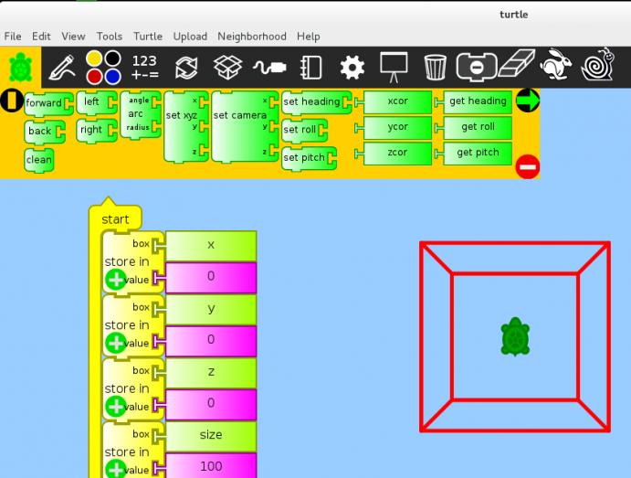

================
Turtle Blocks 3D
================

About
-----
|3d_icon| Turtle Blocks 3D is an extension of Turtle Blocks into three dimensions. Instead of moving a turtle on a plane, the turtle can be moved in a three-dimensional Cartesian space.

.. |3d_icon| image:: ../images/turtleblocks3d-1.png

Additional features include:
* the ability to move the camera
* export .to OBJ files (which can be imported into Blender et al.)
* import from .OBJ

Developer Comment: We plan to add texture mapping.

Gallery
-------

Repositories
------------
`The Git repository <https://github.com/Anubhav-J/turtleart>`_

Download
--------
`Activity page in our activities portal <http://activities.sugarlabs.org/sugar/addon/4757>`_

Support and More Info
---------------------
If you never developed a Sugar Activity, `must read <http://www.flossmanuals.net/make-your-own-sugar-activities/>`_.

Support for this activity is provided by the developer at walter@sugarlabs.org

References
----------
`Download Page <http://activities.sugarlabs.org/en-US/sugar/addon/4757>`_