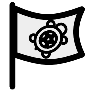
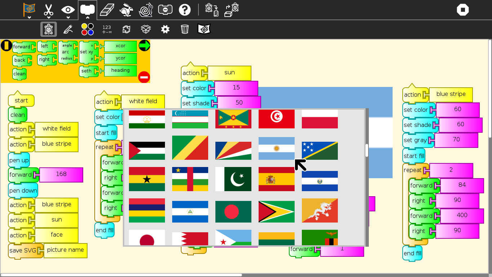
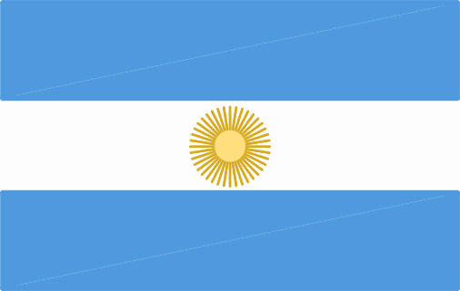
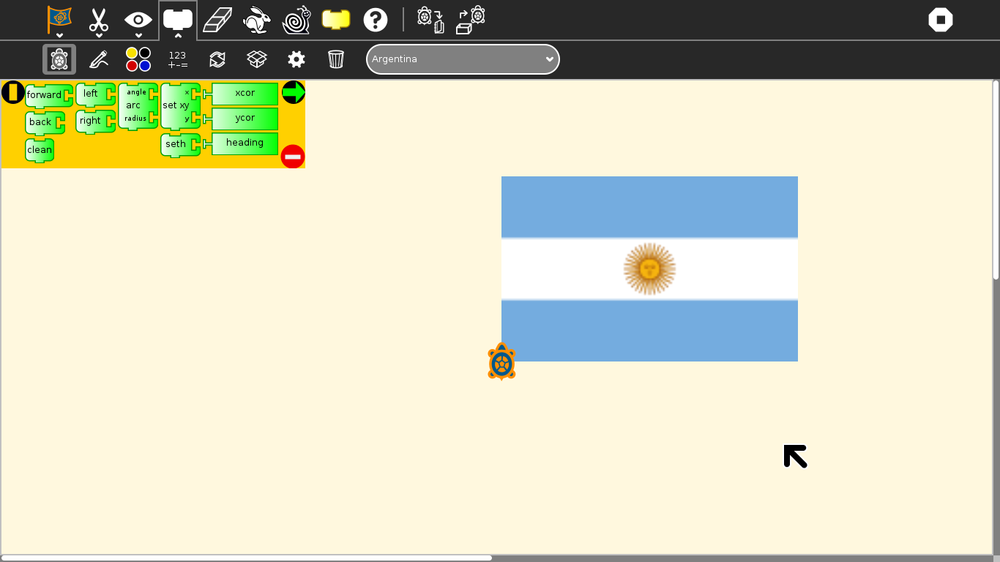
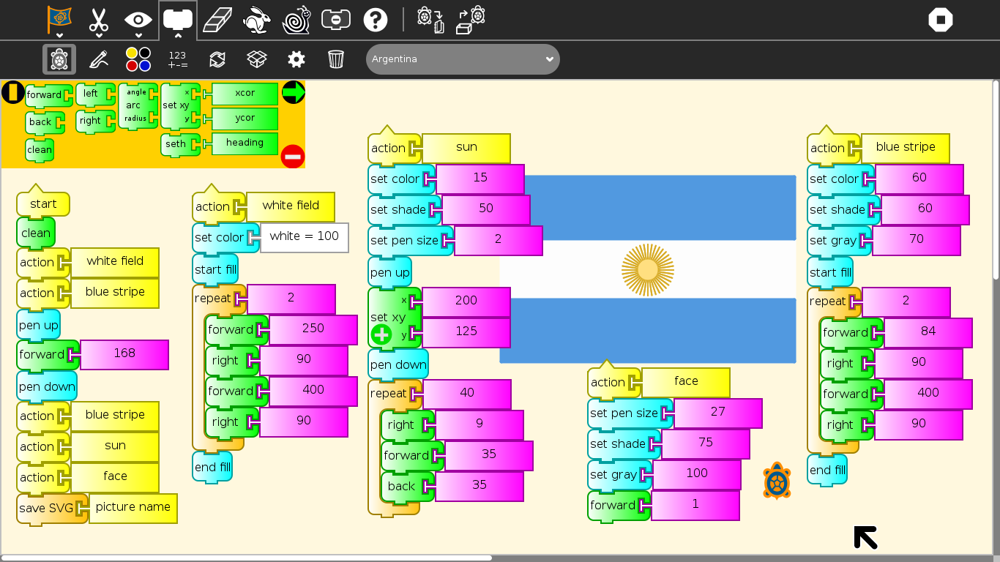
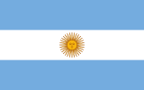
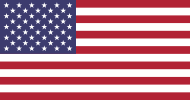
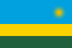

.. _turtle-flags:

============
Turtle Flags
============

Turtle Flags presents more than 200 challenges to the learner that must
be completed using basic Logo-blocks. The challenges are based on
`national
flags <http://en.wikipedia.org/wiki/Gallery_of_sovereign-state_flags>`__.

Turtle Flags is a fork of :ref:`Activities/Turtle Confusion <turtle-confusion>` that presents 
:ref:`40 shape challenges <turtleart-challenges>` to be programmed by
moving the Logo turtle.

|TurtleFlags-1.png| |TurtleFlags-2.png|

On the left, the Argentine flag; on the right, a Turtle Art reproduction

Additional features:

-  You can import challenges from the Sugar Journal (save them as an
   image file)
-  You can save your results as: (1) a Turtle Art program; (2) a UCB
   Logo project; or (3) a PNG image
-  You can overlay Cartesian and polar coordinate grids
-  Additional blocks can be added through the Turtle Blocks plugin
   mechanism

Where to get Turtle Flags
-------------------------

Turtle Flags activity is available for download from the `Sugar Activity Library <http://activities.sugarlabs.org/en-US/sugar/>`__:
`Turtle Flags <http://activities.sugarlabs.org/en-US/sugar/addon/4682>`__

The source code is available on `GitHub <https://github.com/sugarlabs/activity-turtle-flags>`__.

How to play Turtle Flags
------------------------

#. Click on the flag button on the palette toolbar.
#. Select a flag from the flag thumbnail-view (Shown below).
#. Use blocks from the various palettes to instruct the Logo turtle to
   replicate the flag.

--------------

Please refer to the :ref:`Activities/Turtle Art <turtleart>` pages for basic instructions on how to use the block interface and the
details of various toolbars.

The flag challenges are loaded from the Combo Box on the Project
(Palette) toolbar. When you select a flag, it will be loaded onto the
canvas. When you use the Erase button, the current flag is reloaded.

The available blocks are small subset of the Turtle Block blocks: the
basic turtle blocks; a reduced palette of pen and color blocks; some
basic arithmetic operators; the repeat block; and the action and box
blocks.

The Export palette includes save as Logo; save as image; and save as
Turtle Art.

What are the challenges?
------------------------

The 200+ flag challenges are problems of symmetry and geometry which
typically can be solved by using a combination of fill and repeat
blocks.

+-------------+----------------+------------+-------------+----------+--------+
| |Argentina| | |UnitedStates| | |Thailand| | |Australia| | |Rwanda| | |Peru| |
+-------------+----------------+------------+-------------+----------+--------+
| Argentina   | United States  | Thailand   | Australia   | Rwanda   | Peru   |
+-------------+----------------+------------+-------------+----------+--------+

An example of a Turtle Art flag (Argentina)

Reporting problems
------------------

Please report bugs and make feature requests at `activity-turtle-flags/issues <https://github.com/sugarlabs/activity-turtle-flags/issues>`__.

Credits
-------

-  Walter Bender wrote and maintains the code.
-  Brian Silverman is the first author of Turtle Art.

Just for fun
------------

`Flag Map <http://i.imgur.com/ZTw1q74.jpg>`__

