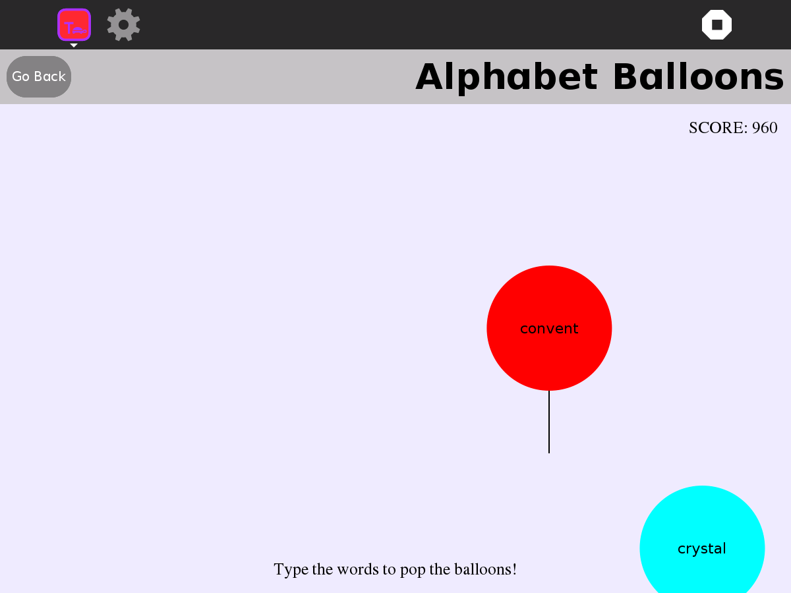
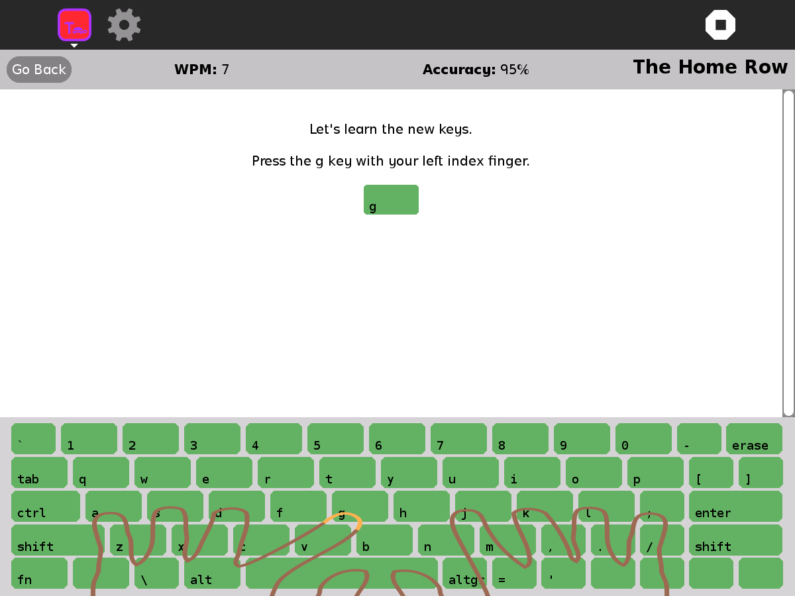
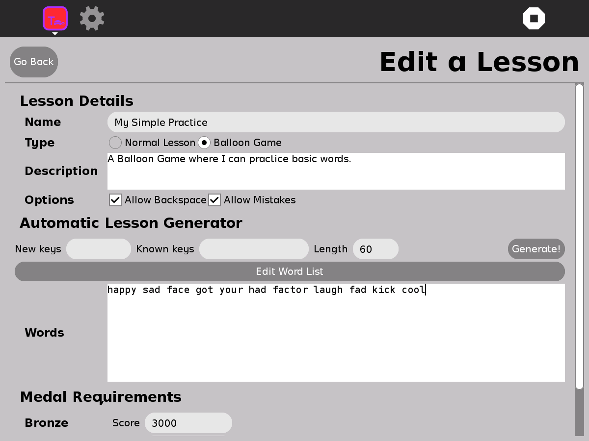

.. _typing-turtle:

=============
Typing Turtle
=============

Typing Turtle is an interactive touch typing program. It gradually
introduces the keys on the keyboard through a series of lessons, until
the student has learned the entire keyboard. Skills are reinforced with
typing games.

Where to get Typing Turtle
--------------------------

Typing Turtle activity is available for download from the `Sugar Activity Library <http://activities.sugarlabs.org>`__: 
`Typing Turle <http://activities.sugarlabs.org/en-US/sugar/addon/4026>`__

The source code is available on `GitHub <https://github.com/sugarlabs/typing-turtle-activity>`__.

Screenshots
-----------

+--------------------+--------------------+--------------------+
| |screenshot-1.png| | |screenshot-2.png| | |screenshot-3.png| |
+--------------------+--------------------+--------------------+

Features
--------

-  An on-screen keyboard with overlaid hand positions shows the correct
   way to press each key, encouraging good typing habits.
-  Automatically picks up and uses the system's keyboard layout.
-  You can make your own lessons, and send them to students or friends.
-  A balloon game provides an entertaining way to gain skill.
-  Medals are awarded as the user completes the lessons. Gold is for the
   best accuracy and speed, followed by Silver and Bronze.

Where to report problems
------------------------

Please report bugs and make feature requests at `typing-turtle-activity/issues <https://github.com/sugarlabs/typing-turtle-activity/issues>`__.

